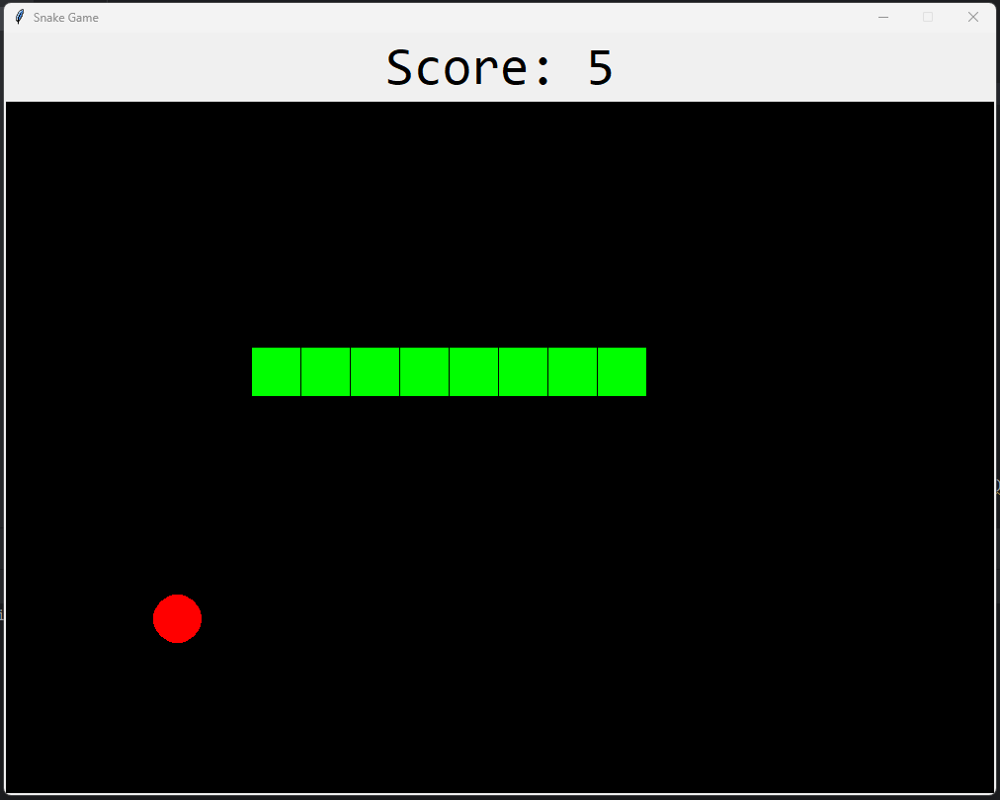
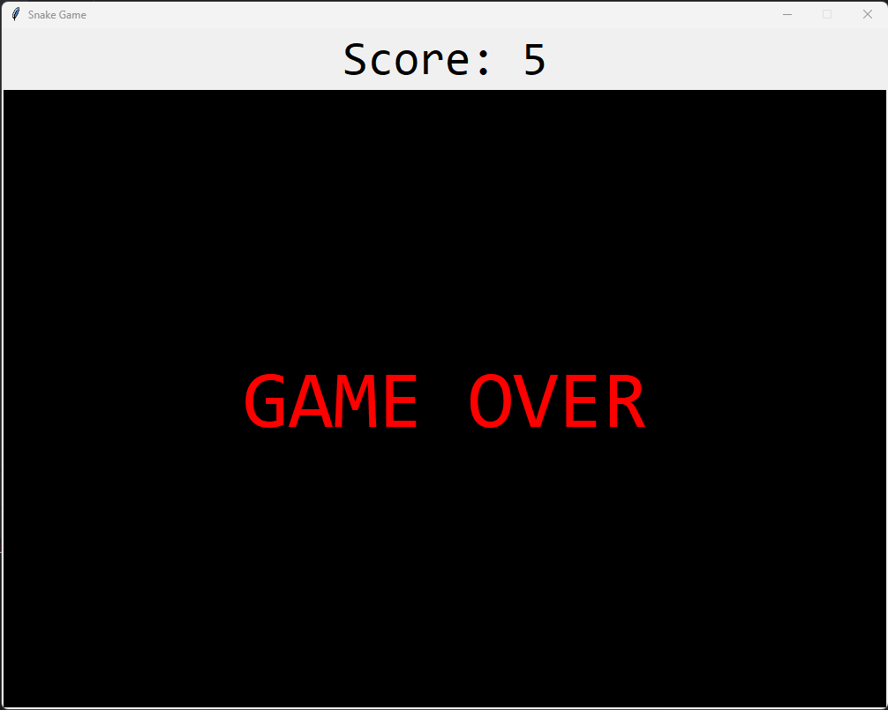

<h1 align="center" style="font-family: 'Orbitron', sans-serif;">Python Snake Game</h1>

  This is a very basic snake game built using python and the Tkinter GUI tool kit. This small project was done inroder to refresh my memory from 1st year Python basics and also to get familiar with Python syntaxes. 

---

## Key Points

- **Boundaries**: Keeping track of GUI boundaries to make sure the snake does not go off-screen.
- **Collision**: Collision for snake, food and boundaries considered.
- **Snake**: Snake starts with a 3 pixel body size and increases as it eats.
- **Score**: A score is kept and updated everytime the snake eats.
- **Game Over**: Game ends when snake hits the edge of the window or collides with itself.

---
## Screenshots

### Gameplay

### Game Over

